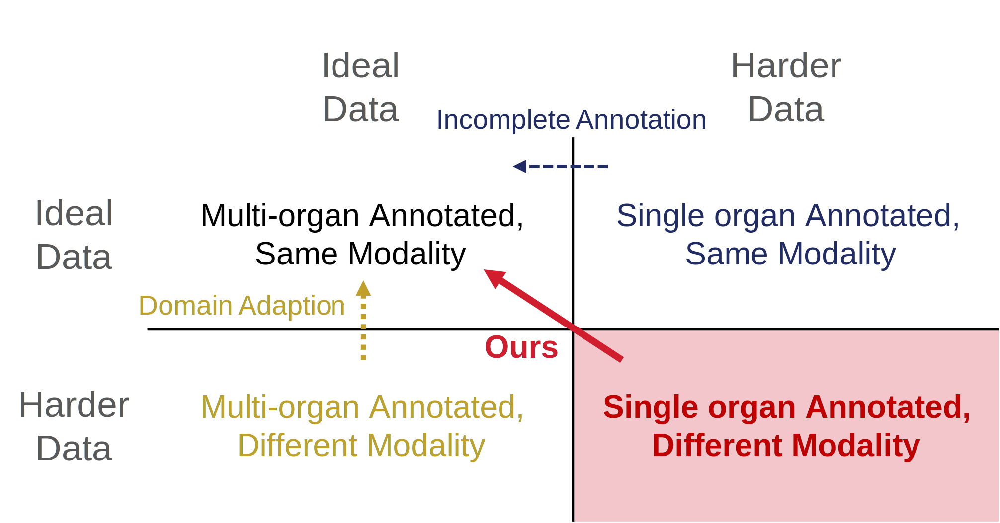
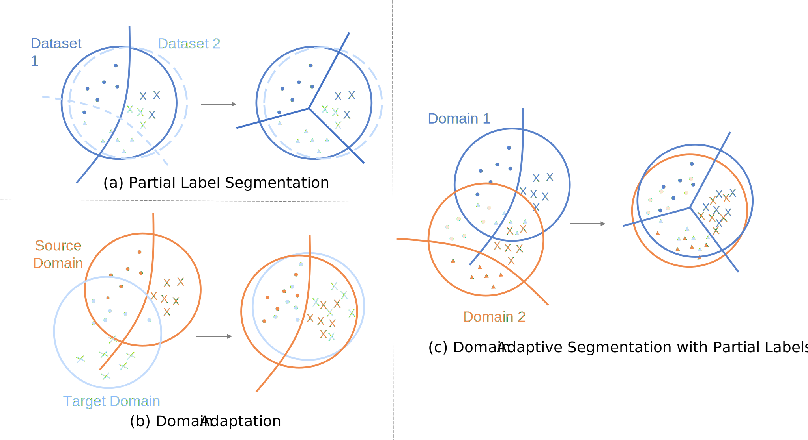
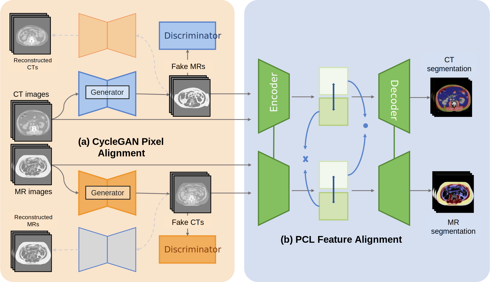
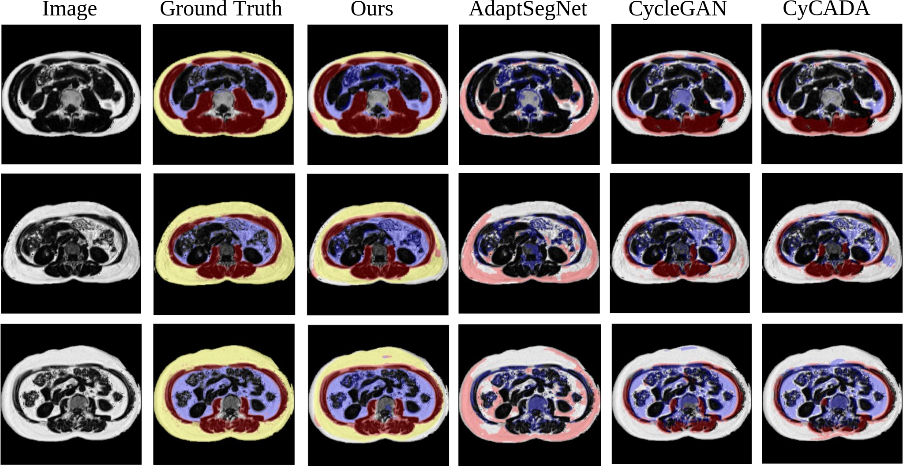
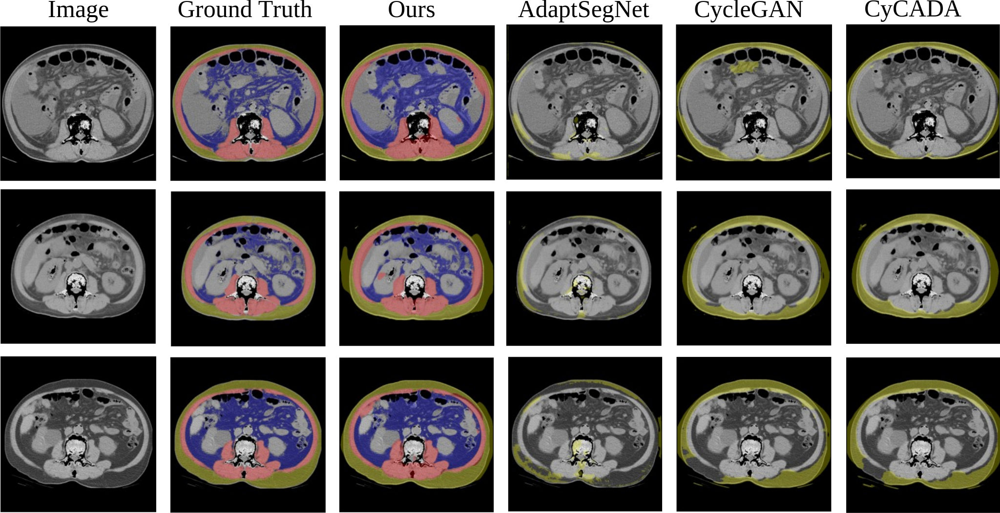
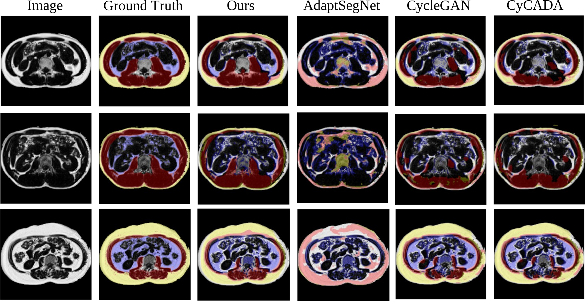

# Prototypical Domain Adaptive NCE

[](https://www.python.org) [![monai-shieldio](https://img.shields.io/badge/MONAI-1.0.1-5ec2b3.svg?logo=data:image/png;base64,iVBORw0KGgoAAAANSUhEUgAAADAAAAAwCAMAAABg3Am1AAABv1BMVEUAAAA+gXpCiYIDBQVWfHk0bmhPcW8FBwcwZV81bmhcv7U1bmgzS0pcwLY2cWwHCgpbvrR2qqdDi4Q4dnAsPz47VlQHDg2PzspFkIkiMzEiMjCX2NR5rqpzpaJvoJxEjodAh38wRUQRIB5bvbN7sK14rKlxo6BvoJ5pl5Q5eHI/XFojS0c7VVQiSUUeQD0dPjqHwb17sa1hiog7e3UvY14nVE8vQ0INGhlQp559s7Btm5gza2UyaWMgRUEYNDEKFRSW19SV1tJYt652w7xWs6pmubFVsad+wbxhsquFvrqDvLh/trJJmZFGk4x0pqNWnJV1p6RYl5FunZpIi4Vmk5BlkY5QhoJRiIRMg35ahYJZgoBVendNdHFMbGpGY2EmUEwkTEg3T04uSkcfQj4cOzgaNzQsPj0IEhGR0MxHhX9KhH8sXlkqWVVZua9/xb9XtayCxsF3wbtzvrdjtK1htK1TrqVSrKJcrqaAt7ReopxTlo9JjohTjYhVjYlGenVFe3Y/bWk9amY6Yl84X1wyUU4yR0YVLCkQIyFbrKRhpZ9hpJ5YoZtYoZpBgns8fnc0bGcxZ2E/Wlhdwbdoxb1mxLugF6vnAAAAknRSTlMApLAEjYiBB3+R/ItR/Y0K+sCvkkJeDuq2PDH9xLy2sqtJIfjFwrSwqpdlXFlYTkvYx52ce2VHHNbMsIeCVD4Y+vfu6+jm5OPe2NbOxLq5ubezq6uopJ6alpWSiIN4bWJfVlVRR0M+FPCinnZr8uvr6ufl4eHf3NnRw7ewpqWVkYR7dWxTTDUo1sXEu7uhoY2Cal+3NwEAAAOmSURBVEjHpZRXe9MwFIaPK2GV4MS1Y2c1myxCSJMAWYWke1K6996LvffeG8oPRjUmyw5c8N5Yj/29j3SOZMF/8uZMYw1n3vwtf77phwbDqfr5OM1raTr/77zWqJ+/0FDFhfpG/Pjht9NQg0kxdOpYV/InQMMRpfIVTb6plEflt6g0h+Fkdb6lvJ4TXdugYulhgGJWV6WfB+bnzcYMULb3+w5EKBmG8/p5eNdsnRa9mwXGNmNt7kMVxind/Oan0JhbNnVcNXOuSGg4DqCpI17VH+8rLOxeecSTqWvjAXbNU9kr4zJQHE2V+aLtZef9WeJ+Lbn4hQ+dLzz+yv0w2unoXOV+Fb/c3sMkh/hgwAJBnt2746VGuY5WdbIL6vq9ttvEgYHlJJfbJ9GBHWWHxA1QGKLBY6rQcNh/Jvvx1cs9R2zSkR5IbG3134s5UrLj6XNu+O5nBgEw1QLq+tkcwp0YT+Zwsi2C8UTbIHZOYHwdh5sPLls0AmzftOaF+wQc2OfyzQHMc3mOtQMaFfLW7iJoBWicdu/O5th00sXTelEAiNvJLQ7OjeenW0FPyIixKwRxA20+gCV5dRFAau9fJag36vXrCuA1PXLzUiIyF1zKCBf9UWF2st+HIo9NHtAXNjv410HXFgZeFqw7wagF2LRbiJGueB2hcJVIgREqoNWLOzsXZQKsFEpyqGejjsCYp1wWX2JiPrDop0tacuJUgiP5KbOoLxRt3DUepHttHEA0Ki8B+NoHJCC9ckNGV9ifcY0vBHFsMExA4IkT0FhOng8sPHTPfNMTLH3WSOA9TzeOG5FmAeZ9YzG6cWQ0GbF2b2sF1EOPBtvJsikn62yfpM/2HCukWPYGS49Gh87RYMS+4bUXu/bohJ3rT6TTiQHZnvpuf/Js7cEtUURloXy8UYvHcwc5MCyupkdCnHK8IeuxrSM4xKYKrT8oJviN35t9itEgQc4kASdhn2Rtb9VP5/78QAXj4eiI+joz9Pz66Bwai3FhsjB645nnT/6M8osWgLJsqJyjgcPCeO9jgqZ6HybZNVtV/iwonFQMMyhsDIfC4aipq+eEPBIJP1ivWI9hGUDHuEsvMq+nZaNBpBfZLaReMuVrSWMwB92tfqWcxu4DsZw3Vl3gK8ZSHczlYuky7hDV9VDOQhVnS71CFoCSgX7XS7kENayovdKgzaucUuuo4Vy5n/rGEFOFTZPXGBq0+XJ3jbrCJajLso5h3Ie/UPh6tJYW+D9+AbmNejNry6UqAAAAAElFTkSuQmCC)](https://github.com/project-monai/monai) [](https://pytorch.org) [](https://github.com/psf/black)

This repository is the PyTorch implementation of [Cross-modality Segmentation Model with Incomplete Annotations for Multiorgan Medical Image Analysis](https://arxiv.org/abs/2030.12345). 

<div class="row" style="display: flex; align-items: center">
  <div class="column" style="flex: 50%;"> </div>
  <div class="column" style="flex: 50%; padding-left:20px"> </div>
</div>


## Abstract
Medical image segmentation is a crucial task in clinical practice, but obtaining large annotated datasets across multiple imaging modalities remains challenging. This thesis proposes a novel framework for cross-modality segmentation using partially labeled datasets from computed tomography (CT) and magnetic resonance imaging (MRI). The framework addresses two key challenges simultaneously: domain shift between modalities and incomplete annotations for target organs/tissues.

A two-stage approach is introduced, combining pixel-level alignment via CycleGAN with feature-level alignment using prototypical contrastive learning. The proposed **Prototypical Domain Adaptive Noise Contrastive Estimation (ProdaNCE)** loss extends traditional contrastive learning by adapting it for domain adaptation and partial labeling scenarios. It encourages the network to align representations of both labeled and unlabeled classes across modalities by treating prototypes from the other modality as positive samples and prototypes from the same modality as negative samples. This novel approach enables the network to learn domain-agnostic feature representations and leverage partial labels from each modality to achieve comprehensive multi-organ segmentation.

The framework is evaluated on a private abdominal CT and MRI dataset for segmenting subcutaneous adipose tissue, skeletal muscle, and visceral adipose tissue. Results demonstrate superior performance compared to existing domain adaptation methods, especially for unlabeled organs. The proposed approach outperforms CycleGAN, CyCADA, and AdaptSegNet baselines, showcasing the effectiveness of the ProdaNCE loss in handling both domain shift and incomplete annotations.

<div class="row" style="display: flex; align-items: center">
  <div class="column" style="flex: 50%;"> </div>
  <div class="column" style="flex: 50%; padding-left:20px"> </div>
</div>


## Installation
1. Create an environment of Python 3.9 with `jupyter`, `pandas`, and  `matplotlib` installed
2. Install PyTorch 2.2.0 through
```
pip install torch==2.2.0 torchvision==0.17.0 torchaudio==2.2.0 --index-url https://download.pytorch.org/whl/cu118
```
3. Clone repo and install python requirements
```setup
pip install -r requirements.txt
```
You may use the latter version of Python or PyTorch if they are compatible to the requirements.

## Training

To train the model in the thesis, run this command:

```train
python train.py --config config/train.yml
```

## Evaluation

To evaluate the model, run:

```eval
python test.py --config config/test.yml --pretrained <checkpoint_dir> --evaluator <dice/hausforff/image/all>
```

## Results


#### Incomplete Annotation + Domain Adaptation

 <div class="row" style="display: flex; align-items: center">
  <div class="column" style="flex: 50%;"> </div>
  <div class="column" style="flex: 50%; padding-left:20px"> </div>
</div>

#### Domain Adaptation
 <div class="row" style="display: flex; align-items: center">
  <div class="column" style="flex: 50%;"> </div>
  <div class="column" style="flex: 50%; padding-left:20px"> </div>
</div>


## Citation   
```bibtex
@article{hong2024crossmodality,
  title={Cross-modality Segmentation Model with Incomplete Annotations for Multiorgan Medical Image Analysis},
  author={Hong, Zhen-Lun},
  year={2024}
}
```